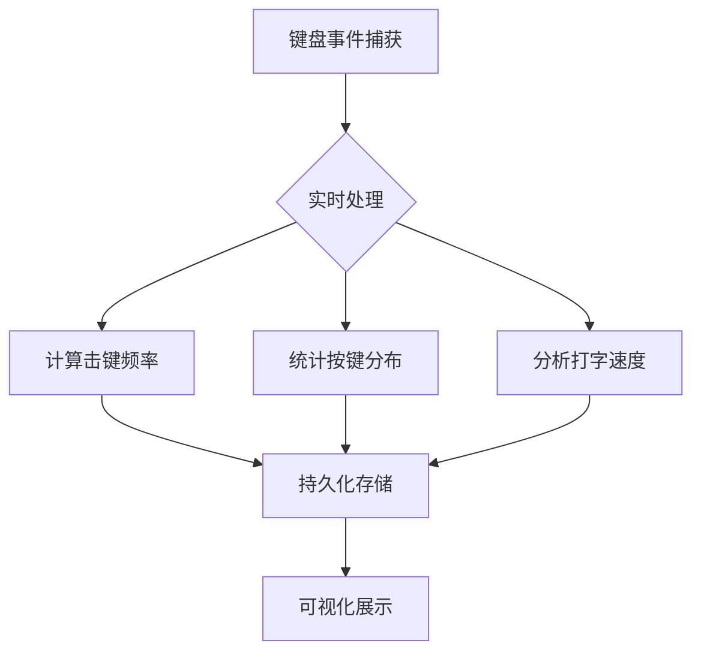
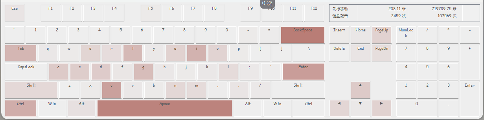

## Keyboard Stats


### 0 整体设计

#### 0.1 数据流




#### 0.2 核心功能

* 按键分布统计

    * ​​数据结构​​：字典存储按键-次数映射
    * 防抖处理​​：延时10ms确认有效按键（避免机械抖动误触发）
    * ​​特殊键识别​​：区分功能键（Shift/Ctrl）与字符键


* 打字速度计算​

    * 公式​​：*打字速度 = 有效字数 / 时间（字/分钟）*
        * 有效字数：连续字母序列计为一个词（中英文适用）
        * 码长优化：中文字需计算平均按键数（如拼音输入码长≈2.5键/字）

    * 状态机实现

    ```python
    is_word = False  # 当前是否在输入单词
    word_count = 0   # 单词计数器
    for event in key_events:
        if event.is_alpha():  # 字母键
            if not is_word:   # 新词开始
                word_count += 1
                is_word = True
        else:               # 非字母键
            is_word = False
    ```


* 击键速度分析​

    * ​实时键速​​：每分钟按键次数（KPM = 总按键数 / 秒 × 60）
    * ​​峰值检测​​：滑动窗口统计最高速时段（例：10秒内最高KPM）


* 高级指标​​

    * ​​错误率​​：退格键（Backspace）频率占比
    * ​​热区图​​：标记高频按键位置（依据键盘布局坐标数据），例如下面的形式，频次越高的键颜色越深

        

    * ​​节奏分析​​：按键间隔标准差（稳定性指标）


#### 0.3 其他功能

* 长按与组合键识别

    * ​长按检测​​：计时按键持续时长 >500ms 视为长按
    * ​​组合键​​：状态机跟踪修饰键（如记录`Ctrl+C`事件）

    ```python
    ctrl_pressed = False
    def on_press(key):
        if key == keyboard.Key.ctrl_l:
            ctrl_pressed = True
        elif key == 'c' and ctrl_pressed:
            trigger_copy_event()  # 触发组合键动作
    ```

* 数据持久化

    * ​​存储格式​​：JSON/CSV/SQLite（含时间戳、按键码、持续时长）
    * 统计：今日，总计
    * ​​用户画像​​：根据击键模式分类（休闲型/专业打字员/程序员）


#### 0.4 性能优化

* 实时性保障​

    * ​事件队列​​：异步处理避免阻塞主线程（Python用Queue）
    * ​​采样率控制​​：定时器中断替代轮询（降低CPU占用）


*  准确性问题​​

    * ​​输入法适配​​：中英文切换时重置词边界检测
    * ​​噪声过滤​​：忽略系统快捷键（Win+D等）


* 资源消耗​​

    * ​​内存优化​​：分块处理数据（>1小时记录存磁盘）


> * 使用 python 先实现功能，再使用 C/C++ 考虑性能和资源优化
> * 跨平台考虑


### 1 Linux

#### 1.1 编译运行

在Linux系统中，可以通过读取`/dev/input/`设备文件来监控键盘输入。

* 编译命令：

```bash
cd keyboard-stats/src/linux
g++ -std=c++11 keyboard_stats.cpp -o keyboard_stats
```

* 运行，需要以root权限运行（因为要读取输入设备）

```bash
sudo ./keyboard_stats
```

* 停止程序：按`Ctrl+C`停止统计并保存结果


#### 1.2 说明

* 程序功能

    * 按键统计：记录每个键的按下次数
    * 打字速度：计算每分钟输入字符数
    * 敲键速度：计算每秒按键次数
    * 按键间隔：统计两次按键之间的时间间隔
    * 结果保存：将统计结果保存到文本文件


* 实现原理

    * 设备检测：程序自动查找`/dev/input/event*`设备中的键盘设备
    * 事件读取：通过读取`input_event`结构获取键盘事件
    * 统计计算：记录按键次数和时间间隔，计算各种统计指标
    * 信号处理：捕获`Ctrl+C`信号优雅地停止程序


* 注意事项

    * 权限要求：必须使用`root`权限运行
    * 多键盘支持：当前版本只监控一个键盘设备，可以扩展为监控多个
    * 键码映射：程序中只映射了部分常见键码，可以根据需要扩展
    * 系统影响：长时间运行可能占用少量系统资源


----------

**TODO**

- [ ] 添加图形界面或实时数据显示
- [ ] 更多的统计信息
- [ ] 多设备支持
- [ ] 更全面的键码映射
- [ ] 资源占用优化
- [ ] 键盘健康监测​​：统计按键寿命（如机械轴体击键次数预警）
- [ ] 其他实用功能集成
