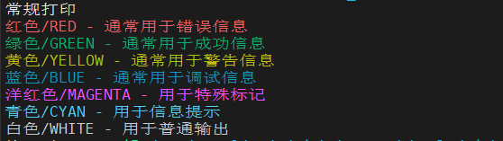
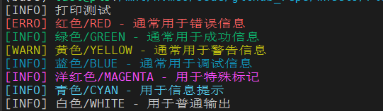
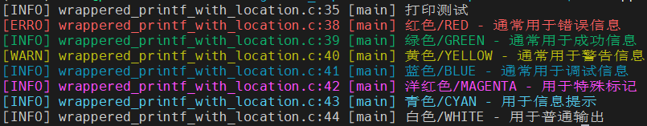
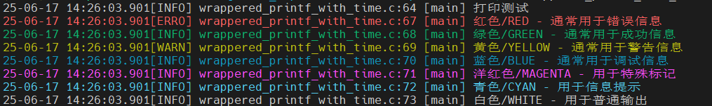

## Richer `printf`

日志打印在调试定位问题的时候非常有用，常规的`printf`只打印日志信息本身，为了进一步更方便的排查问题，可以对打印数据的本身，增加一些额外的信息：

* 给打印的数据增加不同的颜色，通过颜色可以直观的区分不同类型的打印
* 给打印的数据增加其被调用的文件名、行号和函数名，增加这些信息，方便定位代码的位置
* 给打印的数据增加时间戳，在需要了解程序运行的具体时间时很有用


### 1 带颜色打印

终端能识别一些特殊的字符序列，来改变终端输出信息的颜色：

```c
    // 常规打印
    printf("常规打印\n");

    // 带颜色的打印
    printf("\033[31m红色/RED - 通常用于错误信息\033[0m\n");
    printf("\033[32m绿色/GREEN - 通常用于成功信息\033[0m\n");
    printf("\033[33m黄色/YELLOW - 通常用于警告信息\033[0m\n");
    printf("\033[34m蓝色/BLUE - 通常用于调试信息\033[0m\n");
    printf("\033[35m洋红色/MAGENTA - 用于特殊标记\033[0m\n");
    printf("\033[36m青色/CYAN - 用于信息提示\033[0m\n");
    printf("\033[37m白色/WHITE - 用于普通输出\033[0m\n");
```

输出效果：




为了使代码有更高的可读性，使用宏来封装颜色定义：

```c
// 颜色定义
#define COLOR_RESET   "\033[0m"
#define COLOR_RED     "\033[31m"
#define COLOR_GREEN   "\033[32m"
#define COLOR_YELLOW  "\033[33m"
#define COLOR_BLUE    "\033[34m"
#define COLOR_MAGENTA "\033[35m"
#define COLOR_CYAN    "\033[36m"
#define COLOR_WHITE   "\033[37m"
```

并对打印函数进行封装，方便调用：

```c
// printf 函数封装
#define PRINT(fmt, ...)         printf(COLOR_WHITE fmt COLOR_RESET "\n", ##__VA_ARGS__)
#define PRINT_RED(fmt, ...)     printf(COLOR_RED fmt COLOR_RESET "\n", ##__VA_ARGS__)
#define PRINT_GREEN(fmt, ...)   printf(COLOR_GREEN fmt COLOR_RESET "\n", ##__VA_ARGS__)
#define PRINT_YELLOW(fmt, ...)  printf(COLOR_YELLOW fmt COLOR_RESET "\n", ##__VA_ARGS__)
#define PRINT_BLUE(fmt, ...)    printf(COLOR_BLUE fmt COLOR_RESET "\n", ##__VA_ARGS__)
#define PRINT_MAGENTA(fmt, ...) printf(COLOR_MAGENTA fmt COLOR_RESET "\n", ##__VA_ARGS__)
#define PRINT_CYAN(fmt, ...)    printf(COLOR_CYAN fmt COLOR_RESET "\n", ##__VA_ARGS__)
#define PRINT_WHITE(fmt, ...)   printf(COLOR_WHITE fmt COLOR_RESET "\n", ##__VA_ARGS__)
```

这里使用了可变参数：

* `...`：表示可变参数部分，可以是 0 个至多个
* `##__VA_ARGS__`：C 预处理器定义的特殊标识符，代表宏调用时传递的可变参数列表（即省略号`...`对应的参数）
* 当可变参数列表为空时，直接使用`__VA_ARGS__`会导致多余的逗号（如 `fprintf(stderr, fmt, __VA_ARGS__)` 变为 `fprintf(stderr, fmt, )`，导致编译错误）。因此，`##` 的作用是用来消除多余逗号，作用是：
    * 当`__VA_ARGS__`非空时，`##`无实际效果（仅作为分隔符）
    * 当`__VA_ARGS__`为空时，`##`会删除其前面的逗号，避免语法错误


### 2 增加打印等级

常用的分级打印颜色标识：红色对应`ERROR`，黄色对应`WARNING`，其它是I`NFO`。


```c
// 分级打印宏封装
#define PRINT_COLOR(color, level, fmt, ...) \
    do { \
        printf("%s[%s] " fmt COLOR_RESET "\n", \
        color, level, ## __VA_ARGS__); \
    } while(0)


// printf 函数封装 with log level
#define PRINT(fmt, ...) PRINT_COLOR(COLOR_WHITE, "INFO", fmt, ##__VA_ARGS__)
#define PRINT_RED(fmt, ...) PRINT_COLOR(COLOR_RED, "ERRO", fmt, ##__VA_ARGS__)
#define PRINT_GREEN(fmt, ...) PRINT_COLOR(COLOR_GREEN, "INFO", fmt, ##__VA_ARGS__)
#define PRINT_YELLOW(fmt, ...) PRINT_COLOR(COLOR_YELLOW, "WARN", fmt, ##__VA_ARGS__)
#define PRINT_BLUE(fmt, ...) PRINT_COLOR(COLOR_BLUE, "INFO", fmt, ##__VA_ARGS__)
#define PRINT_MAGENTA(fmt, ...) PRINT_COLOR(COLOR_MAGENTA, "INFO", fmt, ##__VA_ARGS__)
#define PRINT_CYAN(fmt, ...) PRINT_COLOR(COLOR_CYAN, "INFO", fmt, ##__VA_ARGS__)
#define PRINT_WHITE(fmt, ...) PRINT_COLOR(COLOR_WHITE, "INFO", fmt, ##__VA_ARGS__)
```

输出效果：




### 3 打印文件名、行号和函数名

打印文件名、行号和函数名，需要用到`__FILE__`、`__LINE__` 和 `__func__` 这些特殊标识符。

* `__FILE__`：当前正在编译的源文件的路径名（由编译器决定，可能是绝对路径或相对路径）
* `__LINE__`：当前代码行在源文件中的行号
* `__func__`：当前所在函数的名称

封装进 `PRINT_COLOR`里面：

```c
#define PRINT_COLOR(color, level, fmt, ...) \
    do { \
        printf("%s[%s] %s:%d [%s] " fmt COLOR_RESET "\n", \
                color, level, __FILE__, __LINE__, __func__, ##__VA_ARGS__); \
    } while(0)
```

输出效果：




### 4 打印时间

自定义一个宏`__CURRENT_TIME__`来获取当前时间：

```c
#define __CURRENT_TIME__ \
    ({ \
        time_t __t = time(NULL); \
        struct tm* __tm = localtime(&__t); \
        static char __buf[26];
        striftime(__buf, sizeof(__buf), "%Y-%m-%d %H:%M:%S", __tm);\
        __buf; \
    })
```

时间处理流程：

* 获取时间戳：`time(NULL)` 返回当前时间的秒数（自 1970 年 1 月 1 日以来）。
* 转换为本地时间：`localtime(&__t)` 将时间戳转换为本地时间（考虑时区）。
* 格式化字符串：`strftime` 按照 `%Y-%m-%d %H:%M:%S` 格式生成可读时间字符串。


如果需要更精确的时间，精确到毫秒，可以使用使用 `gettimeofday` 获取微秒级时间（`tv_usec` 字段），并通过 `/1000` 转换为毫秒:

```c
#include <sys/time.h>
#define __CURRENT_MTIME__ \
    ({ \
        struct timeval __ty; \
        gettimeofday(&__ty, NULL); \
        struct tm* __tm = localtime(&__tv.tv_sec); \
        static char __buf[32]; \
        snprintf(__buf, sizeof(__buf), "%02d-%02d-%02d %02d:%02d:%02d.%03d", \
            __tm->tm_year % 100, __tm->tm_mon + 1, __tm->tm_mday, \
            __tm->tm_hour, __tm->tm_min, __tm->tm_sec, \
            (int)(__tm->tm_usec / 1000)); \
        __buf; \
    })
```


将当前时间的宏封装进打印宏：

```c
#define PRINT_COLOR(color, level, fmt, ...) \
    do { \
        printf("%s%s[%s] %s:%d [%s] " fmt COLOR_RESET "\n", \
                color, __CURRENT_TIME__, level, __FILE__, __LINE__, __func__, ##__VA_ARGS__); \
    } while(0)
```

输出效果：




### 5 python 中调用

python 调用使用的是 ctypes 的方法，这种方法可以很方便的直接使用 C++ 的源码，不需要对 C++ 源码做修改。需要先将 C++ 源码编译成共享库，之后再在 python 里面调用。
python 调用示例：[pycall](https://github.com/Taot-chen/wheels/blob/main/richer-printf/pycall)

```bash
cd pycall
g++ -shared -o richer_printf.so -fPIC richer_printf.cpp
```
